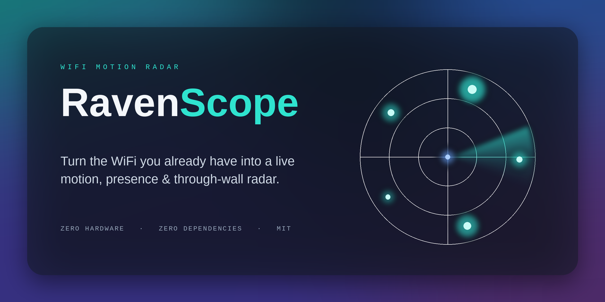
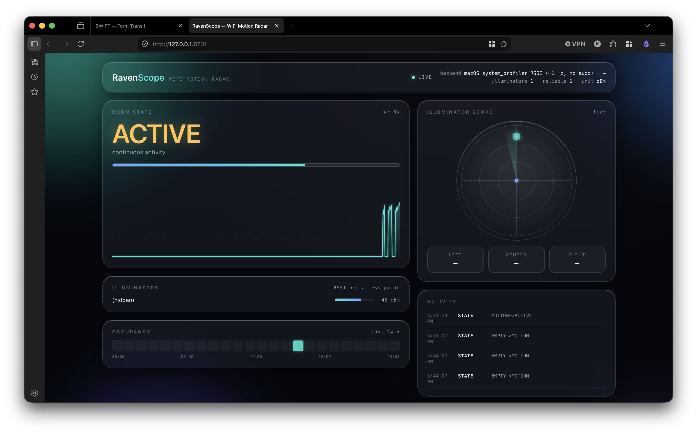
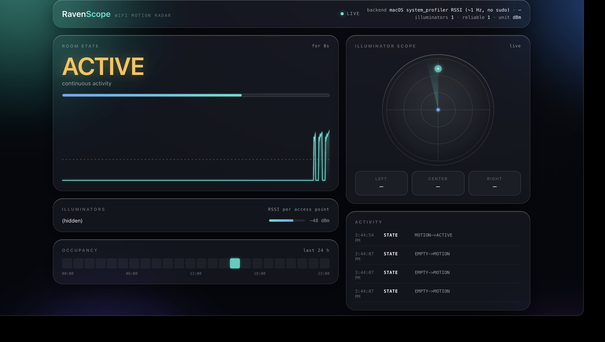

# RavenScope

<p align="center">
  <picture>
    <source media="(prefers-color-scheme: light)" srcset="docs/social-card-light.png">
    <source media="(prefers-color-scheme: dark)" srcset="docs/social-card-dark.png">
    
  </picture>
</p>

<p align="center">
  
  
  
  
</p>

> **Turn the WiFi you already have into a live motion, presence & through-wall radar — zero extra hardware, zero pip dependencies.**

RavenScope watches the signal strength (RSSI) of the access points around a laptop and the tiny fluctuations a moving body imprints on those radio waves. A person moving through the space changes the multipath environment between the laptop and every nearby router or repeater; RavenScope's DSP pipeline pulls that signal out of the noise and turns it into a live readout of an empty / still / moving / active room, a coarse left-center-right direction estimate, and an anomaly alarm — all rendered on a frosted-glass dashboard in the browser.

Because WiFi travels through interior walls, a body in the radio path registers even when it isn't in line of sight — so RavenScope picks up **coarse motion on the other side of an interior wall**, off the routers already in the building. That's the genuinely surprising part, and it's real. The capability section below explains exactly how far it goes, and where it stops.

It runs entirely on commodity hardware using only the Python standard library, and it's built to be forked and extended.

**See it running** — detecting movement, then escalating to continuous activity. macOS, built-in WiFi, a single live access point, no extra hardware:





## Quick start

Requires Python 3.8+ and nothing else — no `pip install`, no compiler, no downloads.

```bash
git clone https://github.com/tmanish/raven-scope.git
cd raven-scope
python3 -m ravenscope
```

The dashboard opens at **http://localhost:8731**. To preview it on a machine with no WiFi (a physics simulator, not real sensing):

```bash
python3 -m ravenscope --simulate
```

## What it can and cannot do — honestly

RavenScope uses **commodity WiFi RSSI**, which is what's available with no extra hardware. RSSI is coarse. Here is the truthful capability table:

| Capability | Status | Notes |
|---|---|---|
| Presence (room empty vs occupied) | ✅ Live | RSSI variance rises when a body perturbs multipath |
| Motion energy (how much movement) | ✅ Live | Windowed RMS of detrended RSSI across all links |
| Activity level (still / moving / active) | ✅ Live | Hysteretic state machine over fused motion energy |
| Coarse through-wall motion | ✅ Live\* | WiFi passes through interior walls; a body in the path still shows up |
| Coarse direction (left / center / right) | ✅ Live\* | Needs several visible APs; meaningless on a single-AP link |
| Anomaly alarm (sudden change) | ✅ Live | Robust z-score with debounce + cooldown |
| Breathing / heart rate | 🔒 Locked | Requires fine-grained **CSI**, not available from commodity RSSI |
| Pose / skeleton | 🔒 Locked | Requires CSI + a trained model (e.g. an ESP32-S3 CSI feed) |
| Through-wall *imaging* / counting / ID | 🔒 Locked | Requires CSI hardware; RSSI can't localize, image, or identify |

**\* About the through-wall and direction rows.** What RavenScope detects is *coarse motion and presence* — "something moved," not "who, where, or how many." Reliability swings a lot with the environment: a body near the laptop↔AP path through a thin interior wall registers well; thick walls, distance, or movement that doesn't sit between the laptop and an access point fade into the noise fast. The strongest, most reliable case is movement that obstructs the line between the laptop and a router. Treat it as a coarse presence/motion sensor that happens to see through interior walls — not a through-wall camera.

The locked rows are **physically impossible from RSSI alone** — no software can recover them without channel-state information (CSI). RavenScope is honest about this in the UI rather than synthesizing a fake heartbeat. Attaching a ~$9 ESP32-S3 CSI source and installing the optional `ruview` extra lets RavenScope detect the CSI core and report that the tier is available (see [Extending RavenScope](#extending-ravenscope)).

## Usage

```bash
# Auto-detect the WiFi backend, calibrate, open the dashboard
python3 -m ravenscope

# Preview with the built-in physics simulator (no radio needed)
python3 -m ravenscope --simulate

# Headless / server box: don't open a browser, just serve
python3 -m ravenscope --headless --host 0.0.0.0 --port 8731

# Pick a backend explicitly
python3 -m ravenscope --backend linux       # nmcli / iw       (best multi-AP)
python3 -m ravenscope --backend windows      # netsh wlan       (good multi-AP)
python3 -m ravenscope --backend macos        # airport / wdutil / system_profiler
python3 -m ravenscope --backend ping         # universal fallback (gateway RTT jitter)

# Longer baseline calibration (default 30s)
python3 -m ravenscope --calibrate 45
```

It can also be installed as a console command with `pip install -e .`, after which `raven-scope` runs it directly.

### Calibration matters

For the first ~30 seconds RavenScope learns the room's *quiet* baseline. **Stay still or step out of the room during calibration.** A clean baseline is the difference between a crisp empty/occupied readout and a jumpy one — in testing, a clean calibration gave roughly a 5× separation between "quiet room" and "person moving" energy. If detection feels insensitive to gentle movement, recalibrate carefully, then consider lowering `StateConfig.motion_enter` in `state.py` (more sensitivity, more false triggers).

### A VPN can suppress detection

If RavenScope reads a signal but barely reacts to movement, **check whether a VPN is active** — it's a known confounder. A VPN doesn't touch the WiFi radio (so RSSI still reads), but it routes all IP traffic into a tunnel and adds a virtual interface (`utun` on macOS, `tun`/`tap` on Linux). That hurts sensing two ways: the `ping` backend's gateway round-trip now travels through the tunnel to a remote endpoint, so the local multipath jitter that encodes motion gets smoothed out; and the virtual interface can change which interface the OS reports as primary, leaving the reader with stale or empty data. Disabling the VPN restores normal behavior. (Observed on macOS: VPN on → muted/single-link; VPN off → full motion + neighbor signals.)

## How it works

```
WiFi RSSI (per access point)
   → Hampel despike (kill beacon-jitter outliers)
   → EMA baseline + detrend (remove slow drift, keep the wobble a body makes)
   → windowed RMS  → per-link motion energy
   → coherence gate (trust links that agree)
   → multi-AP trimmed fusion  → room motion energy + L/C/R sectors
   → hysteretic state machine  → EMPTY / STILL / MOTION / ACTIVE
   → robust z-score  → anomaly alarm
   → SQLite log + Server-Sent-Events → live browser dashboard
```

Every neighboring router or repeater is treated as a free radar illuminator: the more access points the laptop can see, the better the sectoring and the more robust the presence detection. RavenScope prefers backends that report **all** visible BSSIDs (`nmcli`, `netsh ... mode=bssid`) over ones that only see the connected AP.

### Per-OS notes

- **Linux** — `nmcli` for multi-AP scans, falls back to `iw`. Best multi-AP support.
- **Windows** — `netsh wlan show interfaces` plus `show networks mode=bssid`. Good multi-AP support.
- **macOS** — Apple removed the old `airport` tool and now **redacts the network name (SSID)** from `wdutil`/`system_profiler` unless the process has Location Services permission. RSSI still flows, so sensing works; if the SSID shows blank, grant the terminal app Location access, otherwise RavenScope shows the network as hidden. The no-sudo `system_profiler` path also parses the **"Other Local Wi-Fi Networks"** list, so several illuminators (connected AP + visible neighbours) are available without sudo and direction becomes meaningful — but those neighbour readings come from the periodic scan (slow to refresh), so the connected AP still does most of the live motion work. `--backend ping` remains a reliable universal alternative.
- **Anything** — `--backend ping` measures gateway round-trip-time jitter as a motion proxy. Lower fidelity, but works everywhere with no privileges.

## Dashboard

A single self-contained HTML page in an Apple-style frosted-glass idiom: translucent panels floating over an ambient aurora field, a live motion-energy waterfall, a circular "illuminator scope" showing each access point as a glowing blip with a radar sweep, per-AP signal sparkbars, a room-state panel, a left/center/right sector meter, an event log, a 24-hour occupancy heatmap, and capability chips showing which tiers are live vs locked. It consumes a live Server-Sent-Events stream, updates in real time with no polling, uses the system font stack (no web-font fetch), and respects `prefers-reduced-motion`.

## Extending RavenScope

RavenScope is built to be forked and extended. Two clean seams:

**Add a new radio or platform** — implement the `CaptureBackend` interface in `ravenscope/capture/base.py`. A backend's only job is to return a `Sample` (a `bssid → RSSI` dict, optionally with SSIDs and the primary BSSID) each time `read()` is called; the engine handles timing, DSP, fusion, and state. Register it in `ravenscope/capture/__init__.py`. Use `linux.py` / `windows.py` / `ping.py` as templates.

**Wire in a real CSI source to unlock the locked tiers** — `ravenscope/capture/ruview_csi.py` probes for the RuView / `wifi-densepose` core and reports whether the CSI extractors are importable. Attaching an ESP32-S3 (or other CSI hardware) and feeding its Channel State Information into those extractors makes the breathing / heart-rate / pose / through-wall-imaging capabilities physically possible. RavenScope never fakes them from RSSI; it lights them up only when a genuine CSI stream exists.

Other good places to tinker: thresholds and hysteresis in `state.py`, the despike/detrend/energy DSP in `dsp.py`, and the multi-AP fusion + sectoring in `fusion.py`.

## Privacy

Everything runs locally. RavenScope never sends data anywhere. The optional SQLite log lives in a file the user controls (`--db PATH`, or `--no-store` to disable it). It records only signal statistics and state — never packet contents, never who is connected. No camera, no microphone, no wearable.

## Credits & acknowledgments

RavenScope was inspired by, and implements the RSSI sensing tier described in, the [**RuView**](https://github.com/ruvnet/ruview) WiFi-sensing project by [@ruvnet](https://github.com/ruvnet). RuView articulates the "any WiFi / no hardware" tier (coarse RSSI-based presence and motion) alongside its CSI-based tiers, and the idea of treating neighboring routers as free radar illuminators comes from that work.

For precision about what this repository contains: RavenScope's DSP pipeline, state machine, fusion, server, and dashboard are an **independent, from-scratch implementation using only the Python standard library** — no RuView source code is vendored or copied here. The only point of contact is the optional `ruview_csi.py` probe, which *imports* the `ruview` / `wifi-densepose` package **only if it has been installed separately**, to detect a CSI core; that package is not a dependency and is not bundled. Work that builds on the CSI tier via RuView should credit and follow the license of the RuView project for that portion.

## License

MIT — see [LICENSE](LICENSE).
